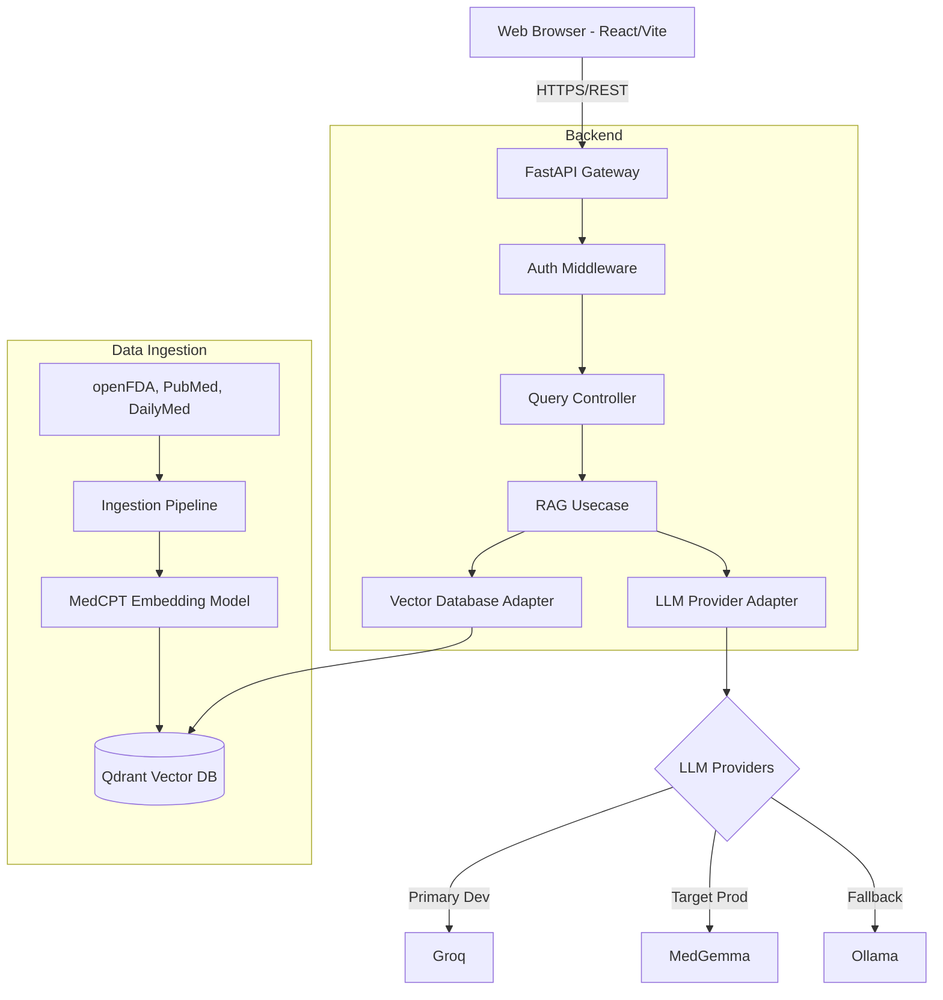
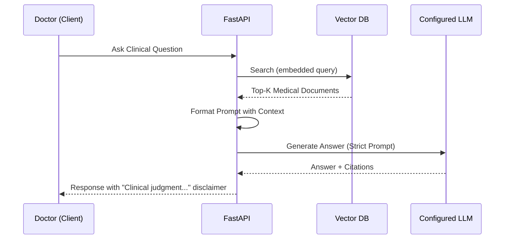

# Software Architecture

## Overall Software Architecture
MedRef follows Clean Architecture and SOLID principles. The system is divided into decoupled layers to ensure that the core business logic (Clinical Reference) is independent of frameworks (FastAPI, React) and external services (LLM Providers, Qdrant).

### Layers
1. **Domain Layer**: Core entities (MedicalQuery, ReferenceDocument, Citation).
2. **Use Case Layer**: Application specific business rules (ProcessClinicalQuery, RetrieveReferences).
3. **Interface Adapters**: Controllers, Gateways, Presenters (FastAPI Routers, Qdrant Repositories, LLM Provider Adapters).
4. **Frameworks & Drivers**: External systems (FastAPI, Qdrant, MedCPT Embeddings, External APIs).

## System Diagram


## Request Flow


## Folder Structure
```text
medref/
├── backend/
│   ├── app/
│   │   ├── core/           # Config, Security, Logging
│   │   ├── domain/         # Entities, Models, Interfaces
│   │   ├── usecases/       # Business logic (RAG, Querying)
│   │   ├── infrastructure/ # LLM Providers, Qdrant Adapters
│   │   └── api/            # FastAPI Routers, Dependencies
│   ├── tests/
│   └── requirements.txt
├── frontend/
│   ├── src/
│   │   ├── components/
│   │   ├── pages/
│   │   ├── services/       # API clients
│   │   └── utils/
│   └── package.json
├── ingestion/              # Data processing and embedding scripts
├── docs/                   # Architecture and rules
└── deployment/             # Docker, k8s, docker-compose
```

## Module Responsibilities
- **Frontend**: Presentation (React/Vite with shadcn/ui and TailwindCSS), input validation, inline citation rendering with hover previews.
- **API Gateway (FastAPI)**: Routing, rate limiting, request validation.
- **RAG Engine**: Orchestrating retrieval, prompt construction, and generation.
- **LLM Adapter**: Abstracting provider-specific APIs (OpenAI, Ollama, etc.).
- **Vector DB Adapter**: Abstracting Qdrant interactions.
- **Ingestion Pipeline**: Downloading, chunking, embedding, and indexing medical data.

## Dependency Graph
- **Frontend** -> **Backend API**
- **Backend API** -> **Core Domain**
- **Backend Infrastructure** -> **Qdrant DB**, **LLM APIs**, **Core Domain (Implementations)**
- **Ingestion** -> **Qdrant DB**, **External Medical Data Sources**

## Configuration Strategy
- **Environment Variables**: Managed via `pydantic-settings`.
- **Provider Switching**: A configuration flag (`ACTIVE_LLM_PROVIDER`) determines which adapter is injected at runtime.
- **Hard-Coded Values**: Minimized. Thresholds for similarity search and chunk sizes are configurable.

## Provider Architecture
A strict `LLMProvider` protocol interface guarantees the application never relies on a specific model. Implementations (e.g., `GroqAdapter`, `MedGemmaAdapter`, `OllamaAdapter`) map to this protocol, making LLMs interchangeable via configuration. Groq will be the primary development provider for speed and iteration, while MedGemma remains the target production model for clinical accuracy.

## Caching Strategy
- **Semantic Caching**: Use Redis for caching frequent identical/similar queries to reduce LLM costs and latency.
- **Static Asset Caching**: CDN caching for frontend assets.

## Deployment Strategy
- **Containerization**: Docker for all services.
- **Orchestration**: Kubernetes or Docker Compose (for smaller/offline setups).
- **Offline Support**: Ability to deploy entirely offline using Ollama + Local Qdrant for strict hospital environments.

## Future Scalability
- **Horizontal Pod Autoscaling (HPA)** for the FastAPI backend.
- **Sharding** in Qdrant for massive document sets (e.g., PubMed full text).
- **Async Processing**: Use Celery/RabbitMQ for long-running ingestion tasks.

## Risk Analysis
- **Hardware Limitations (16GB RAM, RTX 3050)**: Limits local LLM sizes to ~7B-8B parameters (quantized). Requires heavy reliance on efficient chunking and retrieval, and potentially external API fallbacks.
- **Hallucinations**: Mitigated by strict prompts and citation-checking post-processing.
- **Stale Medical Data**: Mitigated by automated periodic data ingestion pipelines.
